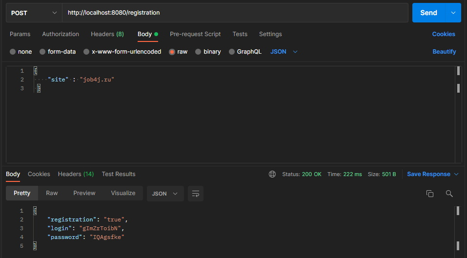
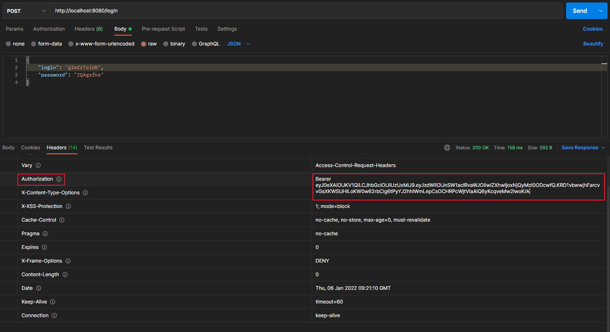
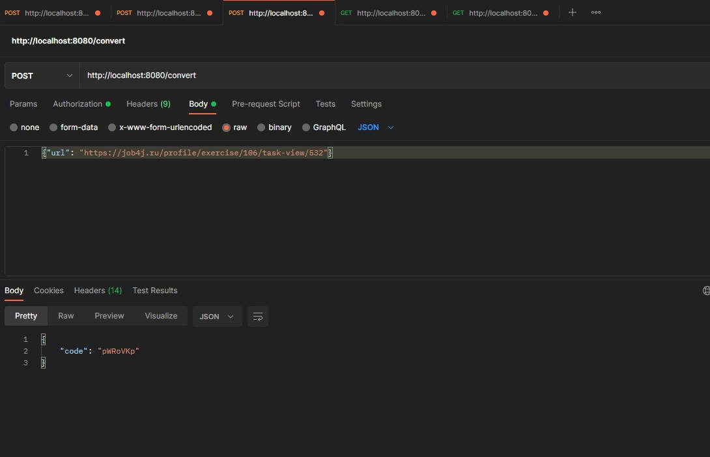
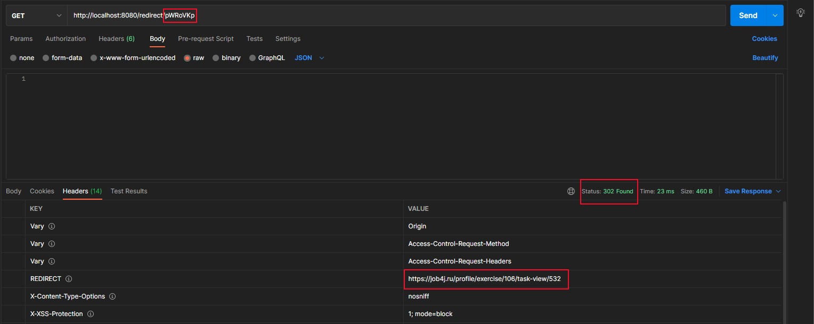
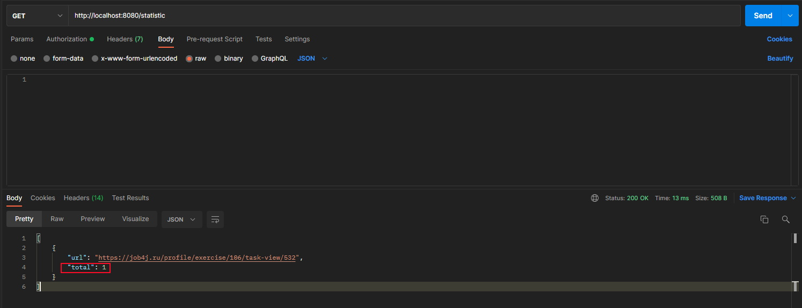

# URL_shortcut

## 
Оглавление

<ul>
<li><a href="#01">Описание проекта</a></li>
<li><a href="#02">Стек технологий</a></li>
<li><a href="#03">Требования к окружению</a></li>
<li><a href="#04">Сборка и запуск проекта</a>
    <ol type="1">
        <li><a href="#0401">Сборка проекта</a></li>
        <li><a href="#0402">Запуск проекта</a></li>
    </ol>
</li>
<li><a href="#05">Взаимодействие с приложением</a>
    <ol  type="1">
        <li><a href="#0501">Регистрация сайта</a></li>
        <li><a href="#0502">Авторизация</a></li>
        <li><a href="#0503">Регистрация URL</a></li>
        <li><a href="#0504">Переадресация</a></li>
        <li><a href="#0505">Статистика</a></li>
    </ol>
</li>
<li><a href="#06">Запуск проекта с использованием Docker</a>
<ol  type="1">
        <li><a href="#0601">Клонирование проекта</a></li>
        <li><a href="#0602">Сборка проекта в Docker image</a></li>
        <li><a href="#0603">Сборка и запуск проекта с использованием docker-compose</a></li>
        <li><a href="#0604">Работа с проектом</a></li>
</ol>
<li><a href="#07">Работа проекта через K8s</a>
<ol  type="1">
        <li><a href="#0701">Создание Secret</a></li>
        <li><a href="#0702">Создание ConfigMap</a></li>
        <li><a href="#0703">Создание deployment для Postgres</a></li>
        <li><a href="#0704">Создание deployment для Spring Boot</a></li>
        <li><a href="#0705">Проверка работоспособности</a></li>
        <li><a href="#0706">Работа с проектом</a></li>
</ol>
</li>
<li><a href="#contacts">Контакты</a></li>
</ul>

## 
Описание проекта

Сервис REST API для кодирования html ссылок во внутренние коды сервиса.

Функционал:

- Регистрация сайта.
- Аутентификация и авторизация с использованием Spring Security.
- Регистрация URL с присвоением уникальных кодов.
- Выполнение переадресации по уникальному коду URL (выполняется без авторизации).
- Вывод статистики по запросам.

<a href="#contents">К оглавлению</a>

## 
Стек технологий

- Java 17
- Spring Boot 2.7, Spring Security, Spring Data
- PostgreSQL 14, Liquibase 4
- JUnit 5, Mockito
- Maven 3.8
- Lombok 1.18
- Docker

  Инструменты:

- Javadoc, JaCoCo, Checkstyle

<a href="#contents">К оглавлению</a>

## 
Требования к окружению

Java 17, Maven 3.8, PostgreSQL 14, Docker

<a href="#contents">К оглавлению</a>

## 
Сборка и запуск проекта

### 
1. Сборка проекта

Команда для сборки в jar:
`mvn clean package -DskipTests`

<a href="#contents">К оглавлению</a>

### 
2. Запуск проекта

Перед запуском проекта необходимо создать базу данных shortcut
в PostgreSQL, команда для создания базы данных:
`create database shortcut;`
Средство миграции Liquibase автоматически создаст структуру
базы данных и наполнит ее предустановленными данными.
Команда для запуска приложения:
`mvn spring-boot:run`

<a href="#contents">К оглавлению</a>

## 
Взаимодействие с приложением

### 
1. Регистрация сайта

Сервисом могут пользоваться разные сайты. Каждому сайту выдается пара логин и пароль.
Чтобы зарегистрировать сайт в системе, необходимо отправить запрос:

Вызов:
`POST http://localhost:8080/registration`

C телом JSON объекта:

`{"site" : "job4j.ru"}`

Ответ от сервера:

`{
"registration": true/false,
"login": УНИКАЛЬНЫЙ_КОД,
"password": УНИКАЛЬНЫЙ_КОД
}`

Пример:

Флаг `registration` указывает, что регистрация выполнена или нет,
`false` - сайт уже есть в системе.

<a href="#contents">К оглавлению</a>

### 
2. Авторизация

Пользователь отправляет POST запрос
с `login` и `password` для сайта и получает Authorization `key` в блоке `Headers` у параметра `Authorization`.

Вызов:

`POST http://localhost:8080/login`

C телом JSON объекта:

`{"login": "gImZrToibN", "password": "IQAgsfke"}`

Пример:

<a href="#contents">К оглавлению</a>

### 
3. Регистрация URL

Поле того, как пользователь зарегистрировал свой сайт он может
отправлять на сайт ссылки и получать преобразованные ссылки в коды.

Вызов:

`POST http://localhost:8080/convert`

C телом JSON объекта:

`{"url": "https://job4j.ru/profile/exercise/106/task-view/532"}`

Ответ от сервера:

`{"code": УНИКАЛЬНЫЙ_КОД}`

Пример:

<a href="#contents">К оглавлению</a>

### 
4. Переадресация

Выполняется без авторизации.
Когда сайт отправляет ссылку с кодом в ответ возвращается
ассоциированный адрес и статус 302.

Вызов:

`GET http://localhost:8080/redirect/УНИКАЛЬНЫЙ_КОД`

Ответ от сервера в заголовке:

`HTTP CODE - 302 REDIRECT URL`

Пример:

<a href="#contents">К оглавлению</a>

### 
5. Статистика

В сервисе считается количество вызовов каждого адреса.
По сайту можно получить статистку всех адресов и количество вызовов этого адреса - параметр `total`.

Вызов:

`GET http://localhost:8080/statistic`

Ответ от сервера JSON:

`{`
{"url": URL, "total": 0},
{"url": "https://job4j.ru/profile/exercise/106/task-view/532", "total": 103}
`}`

<a href="#contents">К оглавлению</a>

## 
Запуск проекта с использованием Docker

### 
1. Клонирование проекта

В CLI выполнить команду - `git clone https://github.com/AMEMELYANOV/job4j_url_shortcut.git`.
В текущей директории будет создана папка `job4j_url_shortcut`, содержащая проект.

<a href="#contents">К оглавлению</a>

### 
2. Сборка проекта в Docker image

В CLI выполнить команду - `docker build -t shortcut .`.

<a href="#contents">К оглавлению</a>

### 
3. Сборка и запуск проекта с использованием docker-compose

Для сборки Docker образов сервисов приложения необходимо перейти в корневую папку приложения (должна содержать
файл docker-compose.yml) и в CLI выполнить команду - `docker-compose build`.
Для создания контейров из образов и запуска приложения необходимо выполнить команду - `docker-compose up`.
Если образы приложения отсутствуют в локальном репозитории, выполнение команды `docker-compose up`
сначала соберет образы сервисов, далее на их основе создаст котейнеры и выполнит их запуск.

<a href="#contents">К оглавлению</a>

### 
4. Работа с проектом

Работа с проектом осуществляется через любое приложение поддерживающее REST запросы, например CURL или Postman.

<a href="#contents">К оглавлению</a>

## 
Работа проекта через K8s

Перед выполнением развертывания необходимо перейти в подкаталог `/k8s`, далее все команды выполняются через CLI

### 
1. Создание Secret

Выполнить команду - `kubectl apply -f postgresdb-secret.yml`.
Выполнить проверку, что `secret` создан - `kubectl get secret`.

<a href="#contents">К оглавлению</a>

### 
2. Создание ConfigMap

Выполнить команду - `kubectl apply -f postgesdb-configmap.yml`.
Выполнить проверку, что `configmap` создан - `kubectl get configmaps`.

<a href="#contents">К оглавлению</a>

### 
3. Создание deployment для Postgres

Выполнить команду - `kubectl apply -f postgresdb-deployment.yml`.
Выполнить проверку, что pod - `postgresdb` создан - `kubectl get pods`.

<a href="#contents">К оглавлению</a>

### 
4. Создание deployment для Spring Boot

Выполнить команду - `kubectl apply -f spring-boot-deployment.yml`.
Выполнить проверку, что pod - `spring-boot` создан - `kubectl get pods`.

<a href="#contents">К оглавлению</a>

### 
5. Проверка работоспособности

Выполнить команду - `kubectl get service`.
Убеждаемся, что сервисы `postgresdb` и `spring-boot` запущены.
Выполнить команду - `minikube service spring-boot-service` для получения ссылки, ip-адреса и порта для дальнейшей
работы.

<a href="#contents">К оглавлению</a>

### 
6. Работа с проектом

Работа с проектом осуществляется через любое приложение поддерживающее REST запросы, например CURL или Postman.

<a href="#contents">К оглавлению</a>

## 
Контакты

&nbsp;&nbsp;

&nbsp;&nbsp;

<a href="#contents">К оглавлению</a>
